# Курсовий Проект
НТУУ "Київський Політехнічнй Інститут" 2023 
Курсовий проект з предмету Інженерія програнмого забезпечення

виконали:
- Ступак Артем IO-15
- Шнайдрук Андрій  IO-15

## Тема
Маркетплейс з можливістю купувати та продавати товари по типу Ebay, OLX 
побудований Django Framework.

Основна програма "Market" є веб-сервісом, який дозволяє переглядати всі доступні оголошення.
Щоб створити власне оголошення, вам потрібно спочатку зареєструватися або увійти, якщо ви вже створили обліковий запис.

## Інструкції щодо запуску
Щоб запустити проект на вашому локальному комп'ютері, будь ласка, виконайте ці кроки:
- Клонуйте репозиторій.
- Переконайтеся, що ви створили віртуальне середовище як інтерпретатор.
- Відкрийте термінал і виконайте наступні команди:
  - pip install -r requirements.txt
  - python manage.py makemigrations
  - python manage.py migrate
  - python manage.py runserver

## Проектування
Django Framework - високорівневий відкритий Python-фреймворк для розробки вебсистем.
Ми обрали цей фреймворк для нашої розоробки через його гнучкість простоту розуміння та невимогливий синтаксис.
Django підпорядковується шаблону архітектурного дизайну MTV (Model-Template-
View):

- модель(Model) - визначає логічну структуру даних і є обробником даних між базою та їх представленням
- шаблон(Template) - атрибут представлення. В Django використовується система текстових шаблонів,
  в яких зберігається все що браузер виводить на сторінки
- представлення(View) - взаємодіє з базою даних через модель і передає данні в шаблони
  для їх виводу та перегляду
- сам веб-фреймвор працює як контроллер, тобто відправляє запити в представлення що відповідає URL-адресу

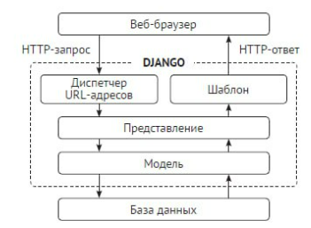

При проектуванні сервісу була обрана база даних PostgreSQL.
Ця база даних ідеально підходить для Django застосунків бо
Django містить безліч вбудованих інструментів для роботи з нею.

### Налаштування фреймворку
Побудова всіх Django проектів подібна і ємодульною. Наш проект не є виключенням.
В одному з модулів ми маємо файл ***"settings.py"*** в якому прописуються всі основні 
налаштування нашого веб-застосунку.
У нас цими налаштуваннями є:
- **INSTALLED_APPS** - частини фпеймворку що використовуються в проекті
- **TEMPLATES** - налаштування всіх використовуваних механізмів шаблонів
- **DATABASES** - шаблон підключення до бази даних
- **AUTH_PASSWORD_VALIDATORS** - список перевірювачів надійності паролів користувача
- **INTERNAL_IPS, LANGUAGE_CODE, TIME_ZONE, USE_I18N, USE_TZ** - глобалізація веб-сервісу
- **static files** - оголошення адресів і налаштувань статичних файлів які система буде обробляти
- **email configurtion** - всі налаштування та прив'язка електронної пошти

### Розробка і підключення складових веб-сервісу
market folder
- apps.py
  - MarketConfig - налаштування основно веб-сторінки середовища яке буде заповнюватись елементами
- api_views.py
  - MarketViewSet - налаштування показу запрограмованих моделей.
- forms.py - форми вводу
  - LoginUserForm - запрограмована форма вводу для входу в акаунт
  - RegisterUserForm - запрограмована форма для реєстрації в системі
    з перевіркою на коректність строки електронної пошти
  - ProductForm - запрограмована форма створення оголошення з перевіркою ціни на додатність
- models.py - моделі атрибутів головної сторінки
  - Category - запрограмована модель вкладки категорій товарів
  - Product - запрограмована модель оголошення що розташовуєтся на головній сторінці
- serializers.py
  - ProductSerializer -  
- urls.py - посилання на розмітки для всіх запрограмованих частин веб-сервісу 
- views.py - підключення всіх запрограмованих атрибутів до шаблонів розміток
  - ProductListView - підключення для списку товарів
  - ProductCategotyView - підключення для категорій товарів
  - OwnerListView - підключення списку опублікованих товарів користувача
  - ProductDetailView - підключення для опису продукту
  - ProductCreateView - підключення для сторінки створення оголошення
  - ProductUpdateView - підключення для сторінки редагування оголошення
  - ProductDeleteView - підключення для сторінки видалення оголошення
  - UserProfileView - підключення для сторінки перегляду користувача 
  - UserProfileUpdateView - підключення для сторінки редагування користувача
  - RegisterUser - піключення для сторінки реєстрації
  - ReserveProductView - підключення сторінки покупки продукту
  - LoginUser - підключення для сторінки входу в акаунт
  - reserve_sucsess - підключення сторінки сповіщення про вдалу покупк
### Розробка дизайну веб сервіс
- login.html - розмітка сторінки входу в акаунт користувача
  містить в собі 2 вікна вводу для логіну та паролю, кнопку підтвердження
  та перехід на сторінку реєстрації якщо користувач не має акаунту.
- register.html - розмітка сторінки реєстрації, містить 4 вікна вводу: для логіну електронної пошти та 2 для пароля, 
  а також кнопку підтвердження
- market_list.html - розмітка вікна списку товарів, містить вкладку категорій
  і вкладку безпосередньо товарів що знаходяться в тій чи іншій категорії
- owner_list.html - список оголошень що розмістив користувач 
- product_confirm_delete.html - вікно підтвердження видалення
- product_confirm_purchase.html - вікно підтвердження замовлення
- poduct_purchase_sucsess.html - вікно сповіщення про те що замовлення зроблено
- product_detail.html - розмітка сторінки продукту
- product_form.html - розмітка сторінки створення оголошення
- profile.html - розмітка сторінки прегляду користувача

## Огляд працездатності
### Тестування
Для тестування використовується модуль UnitTest в нас є три частини тесту
- test_models.py - тестування бази даних та запитів до неї
- test_forms.py - тестування форм вводу та валідації даних
- test_views.py - тестування маршрутизації шаблонів

Тестування запускається командою у терміналі:   
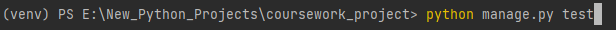

Відбувається пошук усіх тестів проекту та їх виконання:   
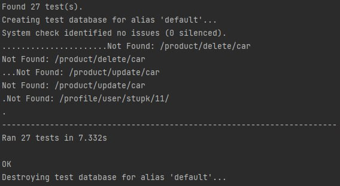

ОК означає що усі тести пройшли без помилок

### Інтерфейс
Сторінка входу:     
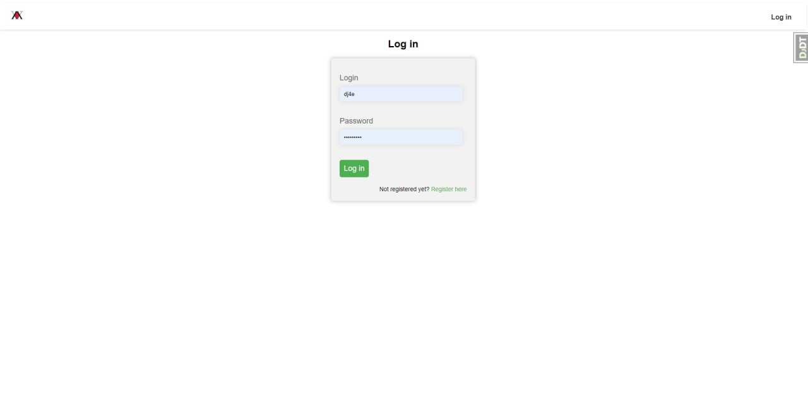

Сторінка реєстраці:     
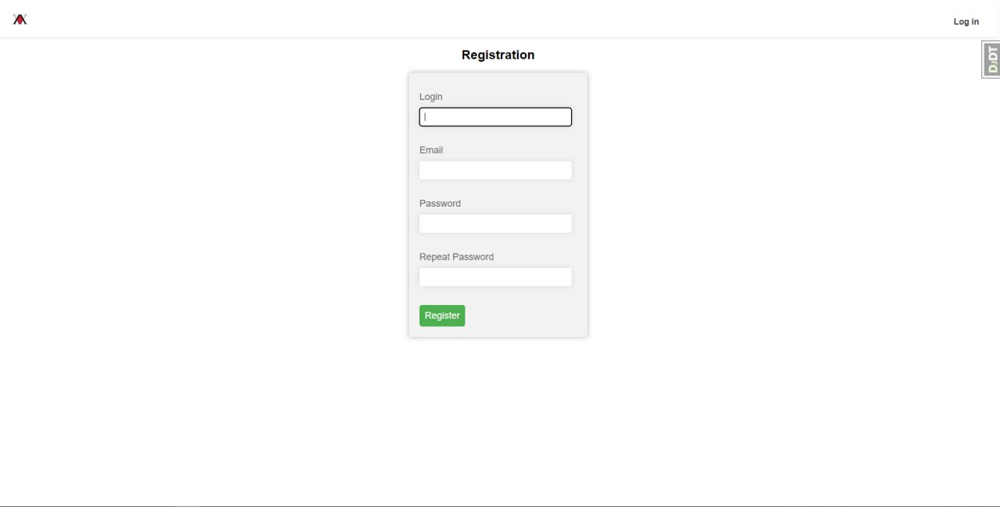

Головна сторінка:   
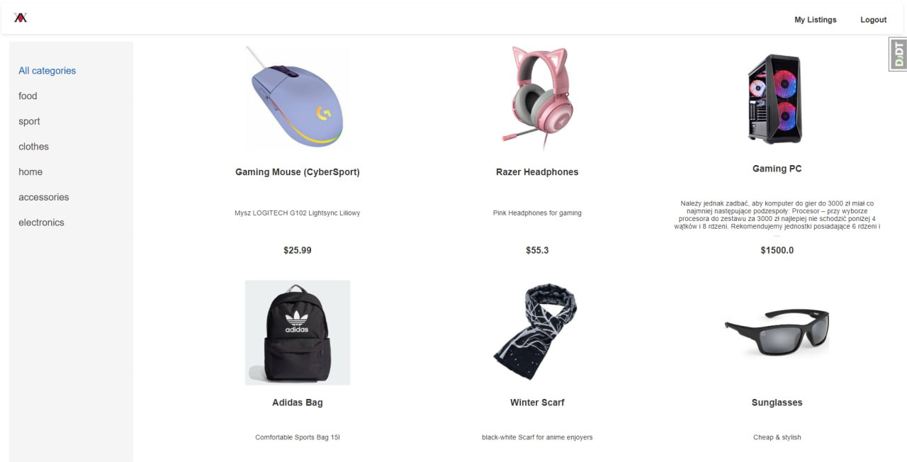

Категорія:    

Сторінка продукту:    
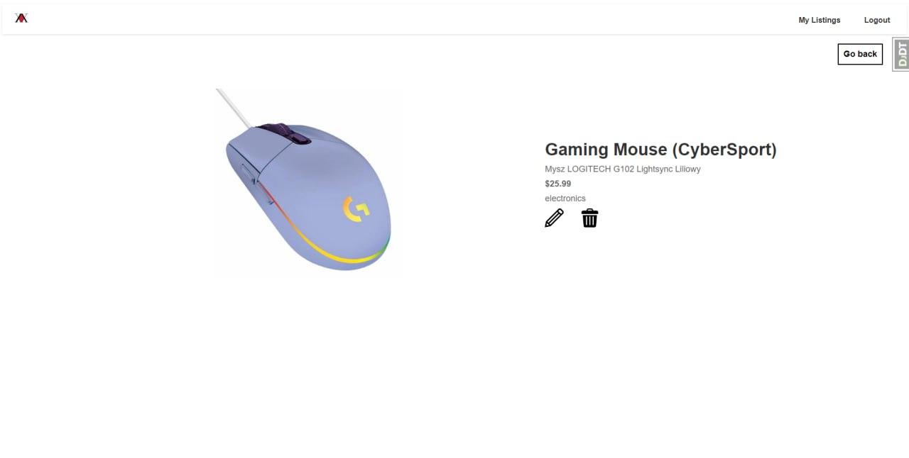

Сторінка ваших товарів:           
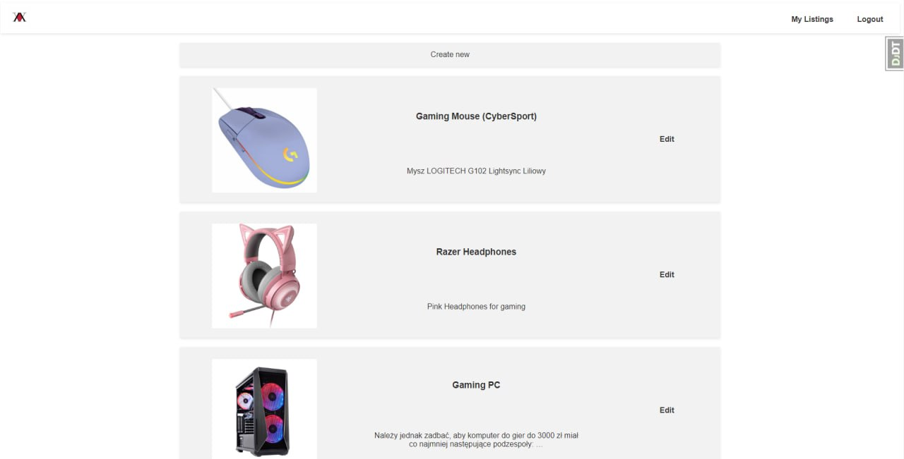

Сторінка створення оголошення:            
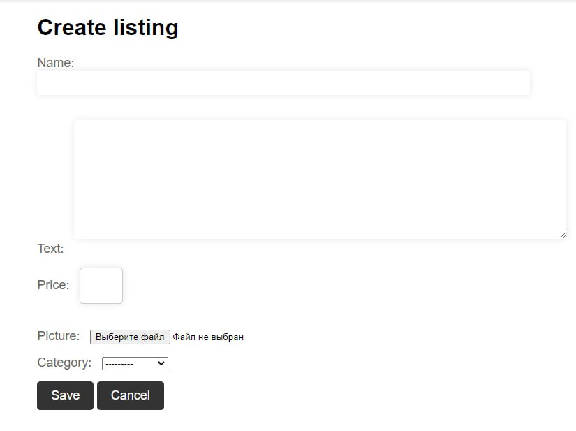

Сторінка підтвердження покупки:           
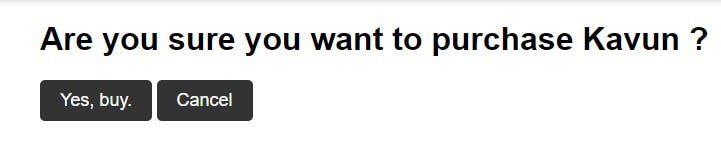

Сторінка сповіщення про успішну покупку:          
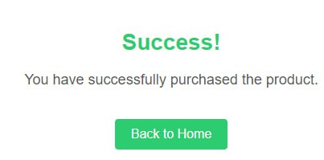

Повідомлення про покупку вашого товару на пошті:             
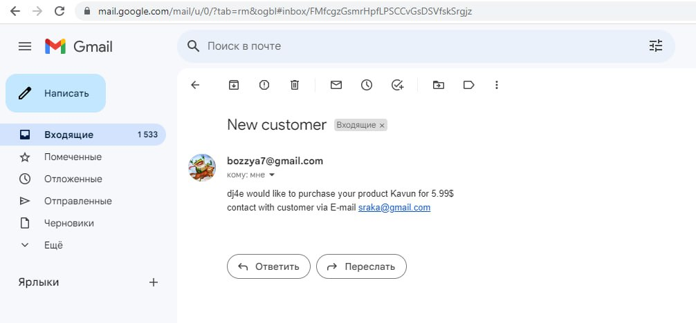

## Висновок
У ході створення курсового проекту були засвоєні теоретичні знання по 
об'єктно-орієнтовному програмуванню, піделюченню і проектуванню баз даних 
та відомості з предмету "Інженерія програмного забезпечення".
На практиці спроектовано продукт на фреймворку Django, що слугує для 
розміщення користувачем оголошень продажу товарів та їх покупки іншими користувачами.